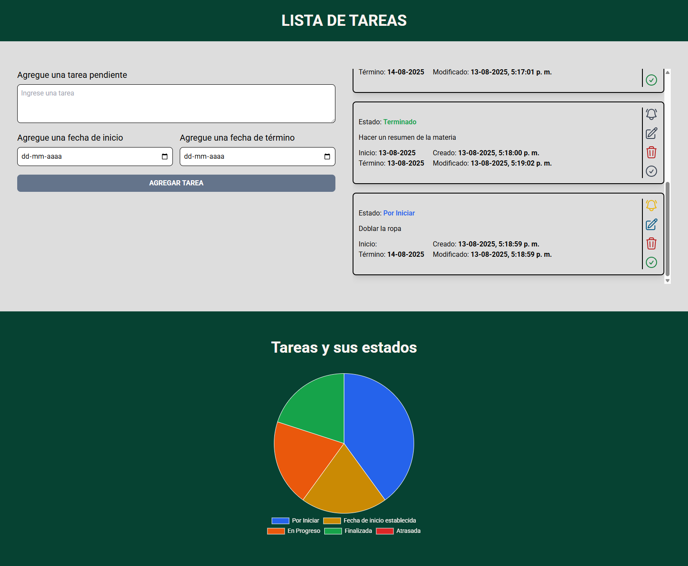

# 📋 Lista de Tareas con Context API y Gráficos

Esta es una aplicación web de lista de tareas desarrollada con **React**, **TypeScript** y **Tailwind CSS**, que utiliza **Context API** para la gestión global del estado y muestra un **gráfico interactivo** con el estado de las tareas.

## 🚀 Características

-   **Agregar, editar y eliminar tareas**.
-   **Asignar fecha de inicio y término**.
-   **Cambio automático de estado** según las fechas.
-   **Estados de tareas**:
    -   Por iniciar
    -   En progreso
    -   Pendiente (fecha de inicio futura)
    -   Terminada
    -   Atrasada
-   **Persistencia en LocalStorage**.
-   **Visualización gráfica** de tareas según su estado usando `react-chartjs-2` y `chart.js`.

## 🛠 Tecnologías utilizadas

-   **React** + **TypeScript**
-   **Context API** para manejo de estado global
-   **Reducer Pattern**
-   **Tailwind CSS** para estilos
-   **Heroicons** para íconos
-   **Chart.js** para gráficos
-   **UUID** para generación de identificadores únicos
-   **LocalStorage** para persistencia de datos

## 📊 Lógica de los estados

-   **Por iniciar**: No tiene fecha de inicio.
-   **Pendiente**: Tiene fecha de inicio futura.
-   **En progreso**: Fecha de inicio actual o pasada y antes de la fecha de término.
-   **Atrasada**: Fecha de término vencida sin completarse.
-   **Terminada**: Marcada manualmente como completada.

El reducer se encarga de actualizar los estados automáticamente al iniciar o finalizar una tarea, y al cargar la aplicación.

## 📊 Visualización de estados con gráficos

La aplicación incluye un **gráfico circular interactivo** para visualizar en tiempo real la distribución de las tareas según su estado.  
Este gráfico se genera con:

-   [`react-chartjs-2`](https://react-chartjs-2.js.org/)
-   [`chart.js`](https://www.chartjs.org/)

### Funcionamiento

-   Cada vez que agregas, editas o completas una tarea, el gráfico se actualiza automáticamente gracias a la gestión de estado con **Context API** y el `Reducer`.
-   Los colores del gráfico representan cada estado:
    -   🟦 **Por iniciar**
    -   🟧 **En progreso**
    -   🟨 **Pendiente**
    -   🟩 **Terminada**
    -   🟥 **Atrasada**

## 📸 Vista previa

## Autor

Desarrollado por [MCavieres](https://www.linkedin.com/in/macarena-cavieres-rubio/)
